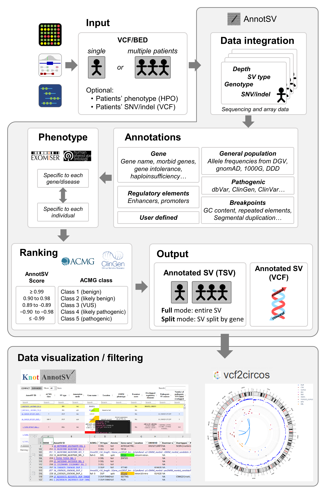

# Webserver overview
The AnnotSV webserver is separated into the annotation part (AnnotSV engine) and the analysis and visualization part:

## Input
Multiple input formats are supported by the AnnotSV webserver corresponding to different usages. One can query directly the server using SV coordinates (format is Chromosome:Begin-End SVType) as an easy and fast way to gather annotations and classification for a single SV. Alternatively and if one requires a larger analysis (multiple SV), a [BED](https://genome.ucsc.edu/FAQ/FAQformat.html#format1) (browser extensible data) file or a [VCF](https://samtools.github.io/hts-specs/VCFv4.3.pdf) (Variant Call Format) file can be submitted.
 
The user can add optional sample related information such as the HPO terms to help prioritization or SNV/indels (additional VCF) to help identify false positive deletion. 

## Annotations
AnnotSV compiles functionally, regulatory and clinically **relevant information** and aims at providing annotations useful to i) **interpret SV potential pathogenicity and ii) filter out SV potential false positives.**
 
These **relevant annotations** are detailed in the [README](../README.AnnotSV_latest.pdf).

## Phenotype-driven prioritization
To link the patient's phenotypic data to the already available knowledge for each gene, AnnotSV provide a phenotype driven prioritization module based on the [HPO (Human Phenotype Ontology) dataset](https://pubmed.ncbi.nlm.nih.gov/30476213/) and [Exomiser](https://www.nature.com/articles/nprot.2015.124) to score each SV (from 0 to 1.0). We generally recommend a score above 0.7 for a known disease gene and 0.5 for a gene not yet related to a disease.

## Ranking
In addition, AnnotSV provides on top of the annotations **a ranking score** to assess SV pathogenicity.
This score is an adaptation of the work provided by [the joint consensus recommendation of ACMG and ClinGen](https://pubmed.ncbi.nlm.nih.gov/31690835/). We especially took attention in scoring as much as possible recessive SV observed in various dataset (NGS, array based...). 
**The SV classification is detailed [here](ranking.md).**

## Output
The output file contains the overlaps of the SV with relevant genomic features where the genes refer to RefSeq or ENSEMBL genes (user defined).

Various output formats are available online to visualize your AnnotSV results:
-  a TSV (tab-separated values) file powered by the AnnotSV Annotation Engine
-  a VCF file powered by [variantconvert](https://github.com/SamuelNicaise/variantconvert)
-  a knot HTML file and a knot XLSM file powered by [knotAnnotSV](https://github.com/mobidic/knotAnnotSV)
-  an HTML CIRCOS PLOT file powered by [vcf2circos](https://github.com/bioinfo-chru-strasbourg/vcf2circos)

## Typical use
A typical AnnotSV use would be to first look at the annotation and ranking of each SV as a whole (i.e. “full”) and then focus on the content of that SV. Indeed, **there are 2 types of lines produced by AnnotSV** (cf the “AnnotSV type” output column):

- An annotation on the **“full” length** of the SV:
Every SV are reported, even those not covering a gene. This type of annotation gives an estimate of the SV event itself.

- An annotation of the SV **“split” by gene**:
This type of annotation gives an opportunity to focus on each gene overlapped by the SV. Thus, when a SV spans over several genes, the output will contain as many annotations lines as covered genes (cf example in FAQ). This latter annotation is extremely powerful to shorten the identification of mutation implicated in a specific gene.

The annotations columns available in the output file are detailed in the [README](../README.AnnotSV_latest.pdf).
